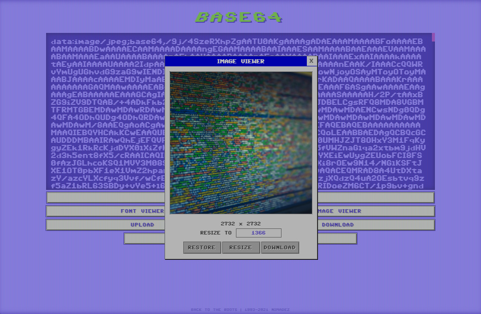

# Base64 Editor

```Version 1.4.4```

[https://nimadez.github.io/base64](https://nimadez.github.io/base64)

## Features
- Base64 encoder and decoder
- Support text, file, image and font
- Support unicode characters *(emoji, asian and middle-eastern)*
- Upload file and URL as text or data
- Download content as text or data *(see supported formats)*
- Encode/decode large files on-the-fly
- Base64 image preview, resizer and converter
- Base64 font preview and download to file
- Support Chrome and Firefox
- Support file drag and drop
- Ad-free, no trackers, no logging

## Supported Data Formats
- Application: JSON, XML
- Text: TXT, HTML, JS, CSS, XML, PY
- Image: JPG, PNG, BMP, SVG, ICO, TIFF, GIF, WEBP
- Font: TTF, WOFF, WOFF2
- Audio: MP3, WAV, WEBA, OGG
- Video: MP4, WEBM

> - You cannot download as data if the format is not supported
> - You can upload files regardless of supported formats

## Keyboard Shortcuts
| *Key* | *Function* |
| --- | --- |
| CTRL + Enter | Convert |
| CTRL + L | Upload File |

## History
```
Created as a web development tool for personal use.
```
</img><br>

## License
Code released under the [MIT license](https://github.com/nimadez/base64/blob/main/LICENSE).
