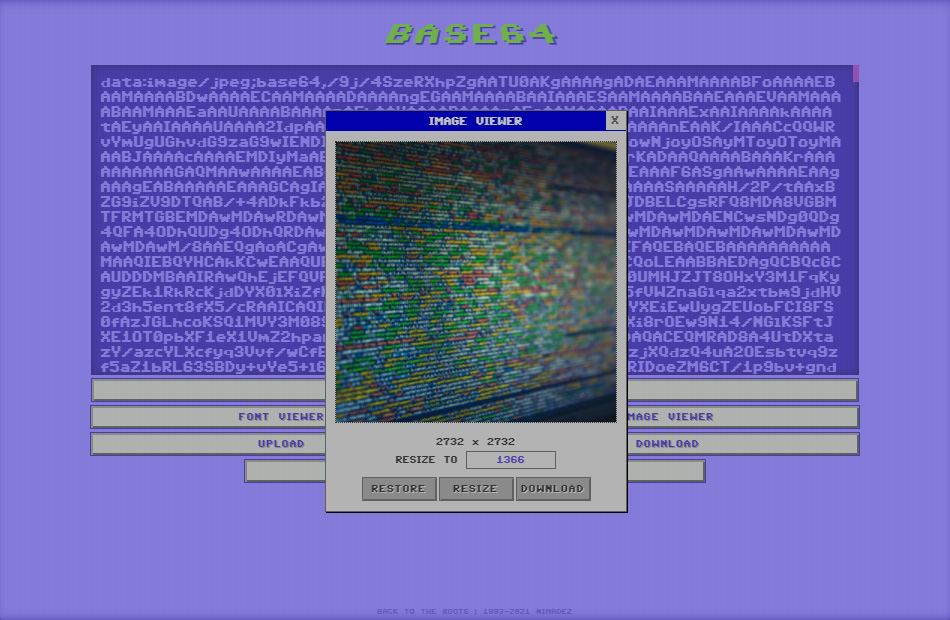

# Base64 Editor

```Version 1.4.1 alpha```

[Try Now](https://nimadez.github.io/base64)

## Features
- Base64 encoder and decoder
- Support text, file, image and font
- Support unicode characters *(emoji, asian and middle-eastern)*
- Upload file and URL as text or data
- Download content as text or data *(see supported formats)*
- Encode/decode large files on-the-fly
- Base64 image preview and resizer
- Base64 font preview
- It can be used to convert images *(e.g. JFIF, SVG)*
- Support file drag and drop
- Ad-free, no miners and trackers

##### * Text area limited to 50 MB max. *(use "Convert File")*<br>* Text area disabled for files larger than 20 MB<br>* Image converted to PNG or JPG on resize *(no SVG coords, no GIF anims)*<br>* Valid URL: direct https links *(https://address.com/image.png)*

## Supported Data Formats
- Text: TXT, HTML, JSON, JS, CSS, XML
- Image: JPG, PNG, BMP, SVG, ICO, TIFF, GIF, WEBP
- Font: TTF, WOFF, WOFF2
- Audio: MP3, WAV, WEBA, OGG
- Video: MP4, WEBM

## Keyboard Shortcuts
| *Key* | *Function* |
| --- | --- |
| CTRL + Enter | Convert |
| CTRL + L | Upload File |

## History
```
Created as a web development tool for personal use,
it helps me save a lot of time on many web projects.
```
</img><br>

## License
Code released under the [MIT license](https://github.com/nimadez/base64/blob/main/LICENSE).
